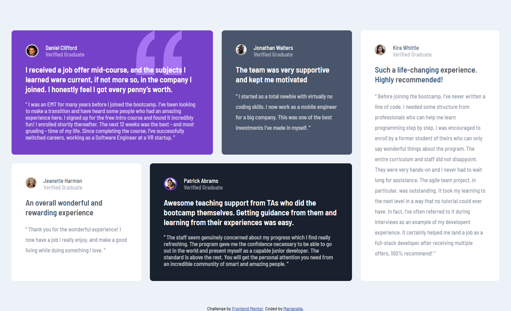

# Frontend Mentor - Testimonials grid section solution

This is a solution to the [Testimonials grid section challenge on Frontend Mentor](https://www.frontendmentor.io/challenges/testimonials-grid-section-Nnw6J7Un7). Frontend Mentor challenges help you improve your coding skills by building realistic projects. 

## Table of contents

- [Overview](#overview)
  - [The challenge](#the-challenge)
  - [Screenshot](#screenshot)
  - [Links](#links)
- [My process](#my-process)
  - [Built with](#built-with)
  - [What I learned](#what-i-learned)
  - [Useful resources](#useful-resources)
- [Author](#author)


## Overview

### The challenge

Users should be able to:

- View the optimal layout for the site depending on their device's screen size

### Screenshot



### Links

- Live Site URL: [live site](https://marianellag1.github.io/testimonial-glowing-adventure/)

## My process

### Built with

- Semantic HTML5 markup
- CSS custom properties
- Flexbox
- CSS Grid

### What I learned

The only way to learn things, is to look at what others used in these type of challenges. I feel that I may be quite there, yet not
there enough. And I thing over and over the limited knowledge I have of coding, and I can't find a solution. I can look through google, 
but I don't quite know what to write to look for that solution. But others that have finished that challange, I can use it and see their
thinking in the challenge, and how different it is from mine, and take something from that and learn and improve my code. 
These two where one, that I found off of another fellow frontend mentorer, and the other from a simple google search. But once I looked it over and inserted it in my code, I feel so good about how the challenge looked. And it helped my knowledge grow a little more.

```css
.five #quote,
.two #quote,
.three #quote {
    font: 500 13px/24px 'Barlow Semi Condensed', sans-serif;
}

.one {
  background-repeat: no-repeat;
    background-position-x: 80%;
}
```

### Useful resources

- [Google](https://www.google.com) - #1 source! 

## Author

- Frontend Mentor - [@Marianellag1](https://www.frontendmentor.io/profile/Marianellag1)

